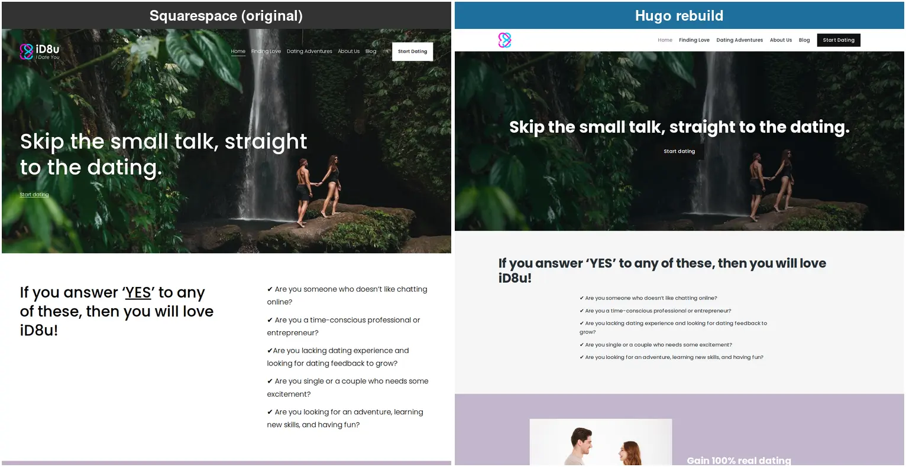
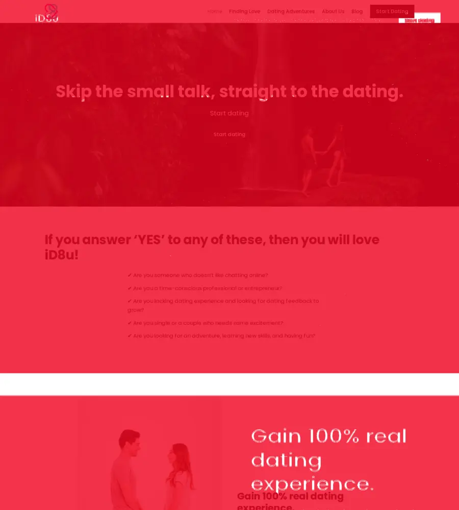

<!-- iamhoi -->

I had a small site sitting on Squarespace. It was the marketing site for id8u, a dating-platform side project I've written about before (the idea that won't die, [here](/posts/id8u-adventure-dating/)). Squarespace is lovely and easy. It is also £204 a year for the Business plan, plus 20 percent VAT on top, so call it £245 a year. For a brochure site that barely changes.

I wanted it on the same stack this very blog runs on: Hugo and Cloudflare Pages. Hugo is a static site generator, which means it takes a folder of plain text files and turns them into a fast website with no database and no login page (nothing sitting there to hack). Cloudflare Pages then hosts the result for free. The only thing left to pay for is the domain name, which is under £10 a year.

So £245 down to under a tenner, for the same site. That maths does itself.

## I didn't build it. I reviewed it

Honest framing first, because this blog is meant to be the evidence and not the highlight reel. I didn't hand-code this rebuild. I run an AI coding agent inside [SST3-AI-Harness](https://github.com/hoiung/sst3-ai-harness), my own setup for getting agents to do real work under a strict process, and I pointed it at the live site and told it to rebuild the thing verbatim. Copy what's there, plain and simple. My job was the design calls and the review. Its job was the typing.

That split, agent types, I review, matters for everything that follows. An agent is brilliant at the things you can check with a script. It is completely blind to the things you can only see.

## The first surprise: the content was hiding

Squarespace does a sneaky thing. The words you read on the page aren't really in the page. The contact form, the terms of service, the privacy copy, all of it arrives as a blob of data the browser assembles after the fact. So if you grab the page the obvious way, you get the skeleton and none of the meat.

We worked that out, read the data blob instead of the visible page, and lifted the real content across word for word. Forms, legal text, the lot. First rule of copying a Squarespace site: don't read the page, read the thing that builds the page.

## Everything passed. That was the trap

The agent rebuilt all ten pages plus a blog post. It stripped the location data out of every photo, all 75 of them. Most are licensed stock images (I don't use photos I haven't got the rights to), so there's nothing to give away there. The one real risk is my own photos: a personal one can quietly carry the exact GPS spot it was taken. Strip it from everything and you never have to think about which is which. It wired up the contact forms. It ran its own review in three passes, a cheap model, then a mid one, then the expensive one, and that last pass actually caught four real defects I'd have shipped: a broken social-share image, a page missing from the sitemap, the wrong photo on one tile, and a couple of ghost pages that shouldn't have existed. All fixed before anything went live.

So far, so good. Build passed. Links worked. Every image had its alt text. No secrets leaked. Every gate green, and the agent reported the site as a faithful copy.

It still looked wrong. I was getting frustrated, lol.

Not broken-wrong. Just... completely off. And not one thing a single check could see was right (wrong) about it.

## What the checks couldn't see

This is the part I keep coming back to. I sat down and looked at the rebuild next to the real site, page by page, and the differences came tumbling out.

The footer was crammed onto one line instead of three. The corners of the cards were rounded; the originals were square. Two sections had their backgrounds the wrong way round. The little app-store badges were missing. There was a duplicate "Start dating" button nobody asked for. The footer text was black on a dark background, basically invisible.

Every single one of those is invisible to a build. The page compiles. The links resolve. The alt text is present. Green, green, green. And it still looks like shit.

I went through eight rounds of this, page by page, and fixed a stack of it. The corners, the footer, the flipped sections, the missing badges, the duplicate button. But here's the honest part, and it's the bit that matters most. I still didn't get it all. Pull the live site up next to my copy right now and the home page gives the game away. My headline sits dead centre where the original sits hard left. The logo lost its wordmark. The whole page runs a good couple of thousand pixels shorter. Eight rounds, my own eyes, and a three-pass screenshot loop, and that drift walked straight through every one of them.

Which is exactly the point. "Looks right" has no floor. You can always find one more thing, and not a single automated check is even looking.

A build does not care whether a heading is white or black. Only eyes do that. And that gap, between everything-passes and it-actually-looks-right, was the whole story of this migration.

## The times the agent got it wrong

I'd asked for a like-for-like rebuild. Copy what's there, nothing clever. And the agent kept doing this anyway, over and over: it looked at a page, decided what it reckoned was there, and built that instead of what was actually on the screen. Two that stuck with me.

The first one: it had a page down as a "dark, immersive hero banner" and started rebuilding it dark. Then we shot the real page and looked properly. It wasn't a dark hero at all. It was a white headline area with a separate dark, starry band sitting underneath it. Two different things. It was about to build one thing as another.

The second one: it decided the feature boxes on the homepage should be white, and changed them. Then the screenshot comparison showed the live ones are a soft lilac, and the closeness score actually dropped (the rebuild had got further from the original, not closer). Caught it, reverted it, before it ever shipped.

Same thing every time. It formed an opinion about the page before it had properly looked at it. Shoot first, design second. The exact mistake a person makes when they trust their first impression, except here the loop caught it.

## The loop that made it cheap, and better gradually

First I looked at the easy option. There's an official frontend-design tool you can bolt onto Claude, and we talked about it. But it's built for "design me something nice". My problem was the opposite: "match this exact thing that already exists, and tell me where I'm off". Different job entirely.

So I came up with my own approach and built it into a small reusable skill in the harness. (Building that skill was where I dogfooded a new piece of the harness, the Claude Code Dynamic Workflow and Security Guidance Plugin that we integrated into SST3.) The idea is dead simple. One page at a time:

1. Take a full-page screenshot of the live site and of my rebuild, at both desktop and mobile widths.
2. Read the live site's actual computed styles, the real colours, spacing and fonts the browser ends up using (not what the code claims, what it actually renders), and print the difference against mine.
3. Run a pixel-difference between the two screenshots for a rough closeness score, plus a highlight image that lights up exactly the bits that don't match.

Then apply the smallest fix the numbers point to, rebuild, and shoot again. Three of those passes per page in one go. If the page still isn't there, run the three-pass loop again. Sometimes a page snaps close in a single set of three. Sometimes it takes two or three loops. It gets you most of the way, fast, though as the home page shows, not always all of the way. (I could make each loop five passes instead of three, but that just burns more tokens for little gain, so I keep it at three and rerun whenever I want.)

The whole thing runs on Playwright and a headless Chromium (a browser with no window, driven entirely by code) installed inside WSL, which is Linux running on my Windows machine. No browser plugins, no paid service, no Windows Chrome needed. And the tool only ever shoots, measures, and suggests. It never touches the live site and it never deploys. It hands me the numbers, I decide.

Why does it work when the green checks didn't? Because it gives you three different kinds of truth at once. The screenshot is what a human actually sees. The computed-style read is the hard number behind the thing your eye flagged (so "that purple looks a bit off" becomes "that's one colour on live and a different one on mine, here are the exact values"). And the closeness score is a cheap trend you can watch fall across the iterations. None of those is a build passing. All three are about how it looks.

Two honest caveats I hit. The closeness number is a blunt instrument: when two pages are different heights, it understates how close they really are, so I learned to trust the side-by-side picture over the number. And the computed-style comparison only works where the bits line up one to one. Squarespace and Hugo name everything differently, so for most of the page you're straight back to using your eyes. Which is rather the whole point.

## The anticlimax (and why it's fine)

Here's the funny ending. After all that, I'm letting the id8u domain lapse. It expires in a few days, a transfer that close to expiry costs money for almost nothing, and the best ideas from id8u are getting folded into a newer dating platform project I'm building instead. So the replica lives on its free Cloudflare address rather than taking over the real domain. You can have a look here: [id8u-655.pages.dev](https://id8u-655.pages.dev/).

So what was the point? The point was never the live domain. It was learning how to lift a site off Squarespace, finding out exactly where the automated safety net stops and your own eyes have to take over (and where even your eyes give up), and walking away with a reusable screenshot loop I'll use on the next migration, and the one after that. (I'm pulling it out into a standalone skill in [sst3-skills](https://github.com/hoiung/sst3-skills), part of my [SST3-AI-Harness](https://github.com/hoiung/sst3-ai-harness) kit, so anyone can run the same loop on their own site.)

Green checks are necessary. They are not sufficient. A passing build tells you the site works. It tells you nothing about whether it looks like the thing you set out to copy. For that, there's no shortcut. You shoot it, you put it side by side, and you actually look.

Trust me on this one. The robot won't do that bit for you. Yet. Just another blog where I bang on about the necessity of a human in the loop (HITL).

<!-- iamhoiend -->
