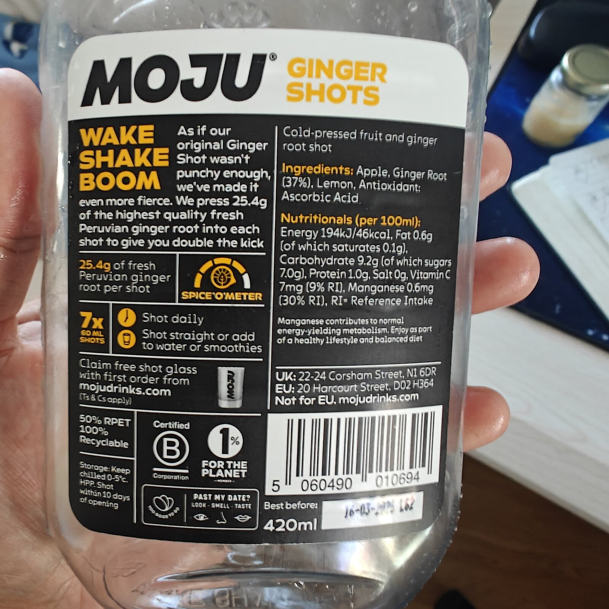
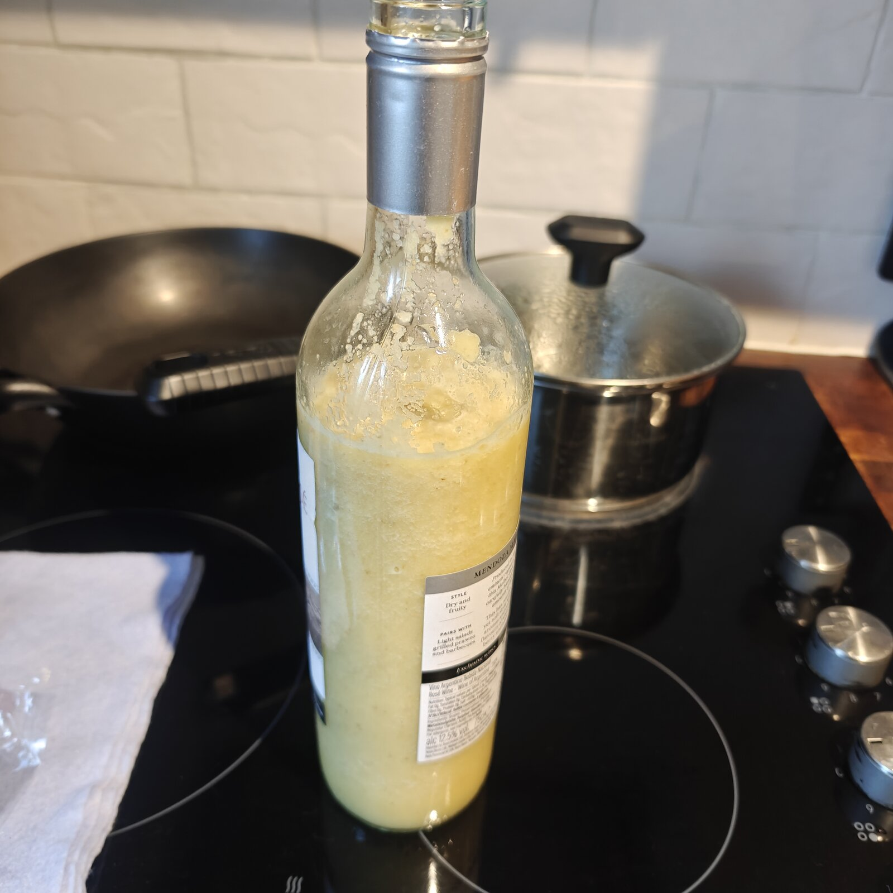
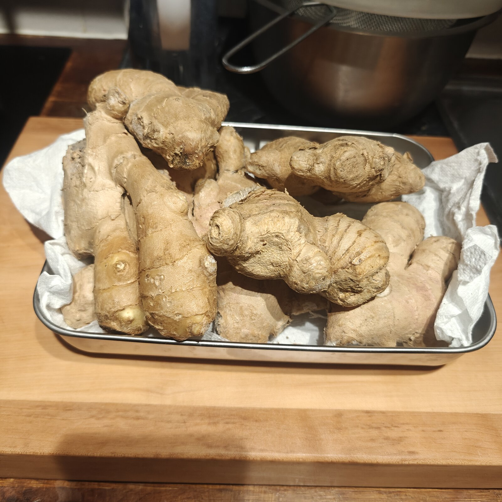

<!-- iamhoi -->

I've been buying Moju ginger shots for two whole years. One shot a day, every morning, religious about it. Eight bottles every eight weeks. About £50 each time. On autopilot.

(That's roughly £325 a year. £650 across two years. Yes, I worked it out. I should've worked it out sooner.)

Then one morning I'm holding the bottle, looking at the back, and my brain finally caught up. Apple. Ginger. Lemon. Ascorbic acid. That's it.

That's IT.

I'd been paying a fiver-plus a bottle for a kitchen recipe with four ingredients. For TWO YEARS!

## The label, the photo, and Claude Code

Here's where it got fun. I took two clear photos of the Moju "Wake Shake Boom" bottle (front and back, with the QUID percentage visible), opened up Claude Code, dropped the photos in, and asked it to read the label and tell me the ginger percentage and the apple-to-lemon ratio.

QUID stands for "Quantitative Ingredient Declaration", which is the bit of the food label the law makes them print. For Wake Shake Boom it says ginger root 37%. That's measured before pressing, by mass. From there it's basic ratio work. Ginger sits at 25.4g per 60ml shot. Apple juice does the bulk of the liquid. Lemon for the bite. Ascorbic acid for vitamin C (and a bit of shelf life).

Got the working out, sense-checked it, wrote it down.

(Quick disclaimer because I'm not in the rip-people-off business: this isn't Moju's recipe. They have an actual recipe with actual cold-press calibration and actual sourcing. What I did was take the *public ingredient percentages they're legally required to print on the bottle* and reconstruct a kitchen version that's close in spirit. Recipes aren't copyrightable in the UK either way, but credit where it's due. Moju got me hooked on the format, got me drinking ginger every day for two years, and got me curious enough to try this in my own kitchen. Hat tip.)

## My tweaks

This is where I diverged from the original.

Skin and fibre stays in. Cold-pressing chucks the pulp, and the pulp is where most of the goodness sits. The gingerol, the fibre, all the bits that make ginger ginger. Bin the pulp and you bin most of what you paid for. So instead of pressing, I blend. Ninja blender, ultra-high setting, 60 to 90 seconds with a pause-and-shake halfway, three or four passes total. By the third pass it's a smooth pulp you can drink straight without feeling like you're chewing ginger root.

About 600ml of liquid goes into the Ninja jug, blends with the ginger, and comes out... around 600ml. What you put in is what you get out, more or less. Pours into a 750ml wine bottle and stops well below the neck. That's the v2 version, drinkable as-is, no dilution needed. (Pulp settles in the fridge after a few hours and drops to the bottom. Shake before drinking.)

Here's the part I really like. Cold-press extracts maybe 40-50% of the ginger by weight as juice and bins the rest. Blending keeps 100%. So even at *less* ginger by mass than Moju, the per-shot punch matches them, because none of it gets thrown away. Same kick. More fibre. Different texture.

No preservatives. Moju has to ship across the country, sit on shelves, survive a couple of weeks in your fridge. I don't. I make a batch, fill a recycled wine bottle, and finish it inside two weeks. Nothing else needed.

The wine bottle thing is just because I had one going spare. Washed out, sterilised, lid swapped. Looks fancy on the fridge shelf, costs nothing, and the dark green glass is good for the apple juice colour (light degrades it fast).

## Bottle 1 was off. Bottle 2 was the one

This is the part I'm most pleased about.

Bottle 1 went in at full Moju ratio. 25.4g of ginger per 60ml shot, scaled up to a Ninja-jug batch. With cold-press that's drinkable. With skin-on blend it's... a dare. You could chew it. The pulp was so thick the blender was basically making ginger paste with a splash of apple juice. Drinkable, technically. Repeatable, no.

I didn't chuck it though. (I'm not binning 150g of perfectly good ginger.) I drank through it by topping the wine bottle up with extra apple juice and a squeeze more lemon every couple of days as I drained it. Diluted as I went. That's why the photo below shows the bottle full to the brim. It's v1 after a few rounds of "still too thick, add more juice".

Bottle 2 was the one. Pulled the ginger back to about 60% of Moju strength (15g of ginger per 60ml shot instead of 25.4g), kept the apple-to-lemon ratio identical, sterilised the wine bottle properly, blended the same way. Tasted it. Tasted it again. Yum. No top-ups needed. Consistency was right out of the blender.

That's the version I've been making since. Same ratios, same blender, same wine bottle. About a month in now and it's the morning shot, dialled.

## The maths

Let me show the working, because this is the bit that actually made me sit down and write this.

A Moju Wake Shake Boom multi-shot bottle is 420ml (7 shots of 60ml each, one a day). I was paying about £50 for 8 bottles every 8 weeks via subscription. That works out to:

- £6.25 per 420ml bottle
- About **1.5p per ml**
- Annualised: **~£325 a year** on shots alone

My homemade v2 batch yields about 600ml (no aeration trick, what goes into the Ninja comes out roughly the same volume) and costs me under £1.50 in ingredients. That works out to:

- About **0.25p per ml** (depending on the price of ginger that week)
- Roughly **6x cheaper** by volume
- Annualised: **~£55 a year**

Saving: about £270 a year. Or, framed differently, I paid roughly £650 across two years for something I can now make for £110.

(I'll let that sit for a second.)

## The ginger overkill

Now here's the bit that made me laugh at myself. When I committed to making my own, I went to the local grocer and bought a kilogram of ginger for under a tenner. A FULL KILO. I came home feeling smug, like I'd cracked the system.

Then I ran the numbers on what one batch actually needs (about 150 grams) and realised... I had way, way more than I needed. Even at three batches a month, that 1kg is going to last me a stupid long time. Blending compresses ginger down to nothing. Cold-pressing throws most of it away anyway. Either way, you do not need a kilo at a time.

So if you're around and want some... ginger anyone? ;)

## The takeaway

If you're already on a ginger-shot habit, do this. Photograph the label. Ask any AI vision tool to read the QUID and break down the ratios. Blend yours in a Ninja with the skin on. Recycle a wine bottle. Bottle 1 will probably be off. Bottle 2 will be the one.

You'll save a few hundred quid a year. Keep all the fibre. Know exactly what's in the bottle (no mystery preservatives, no shelf-life chemistry you didn't sign up for). And probably end up with a kilo of ginger you don't know what to do with.

Worth it.

## In the kitchen



<!-- iamhoiend -->
