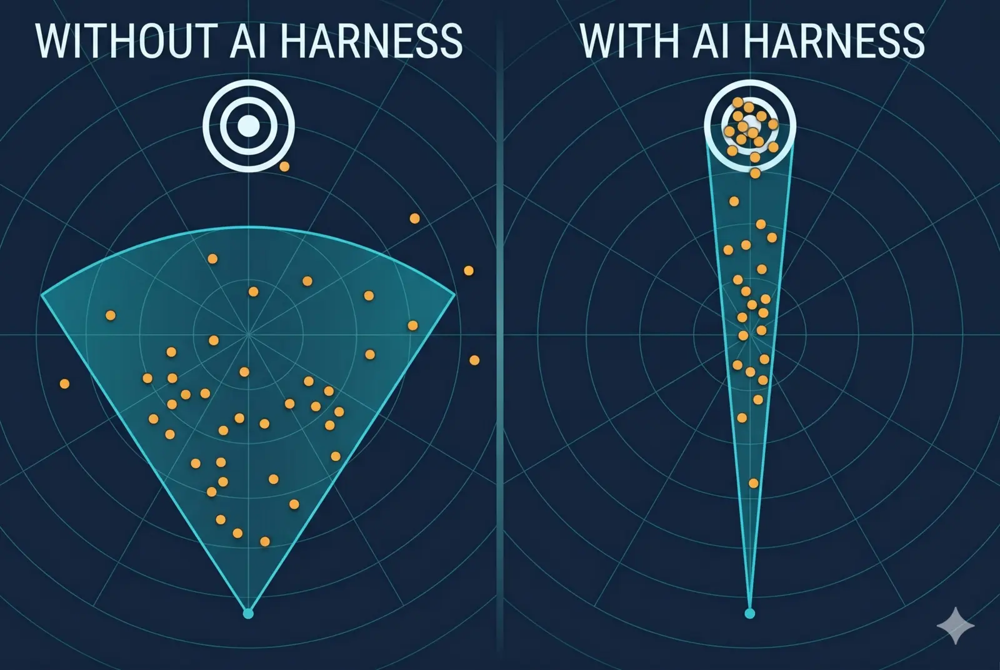

<!-- iamhoi -->

You paste a prompt into ChatGPT. It works. First try. You close the tab feeling smart.

You paste the same prompt tomorrow. Different answer. Completely different. Not slightly rephrased. Sometimes not even in the same direction. Same prompt. Same AI. Not the same result.

Nobody really warns you about this bit on the way in. But this is THE thing. Pretty much everything else flows from it.

## The dice machine

Under the bonnet, an LLM is not a brain. It is a probability machine. For every word-piece it generates, it ranks candidates with a probability attached. "The cat sat on the ___" might give you `mat` at 62%, `floor` at 18%, `sofa` at 9%, and a long tail of stranger options. Then it rolls a weighted dice and picks one. Same dice. Different roll every time.

The three knobs that control the dice are called **temperature** (flattens or sharpens the odds), **top-p** (only consider candidates that cover P% of the probability), and **top-k** (only consider the best K). Narrow settings give you safer, more boring output. Wide settings give you creativity, and also hallucination.

Here is the kicker. Every single token is a fresh dice roll. A 1% chance of veering off per token, compounded across 200 tokens, is about an [87% chance of drift by the end](https://wand.ai/blog/compounding-error-effect-in-large-language-models-a-growing-challenge). So the 800-word essay it writes for you today? Not the same essay tomorrow. Not even close.

## Temperature zero is not the escape hatch

You will read somewhere that if you set `temperature = 0`, you get the same answer every time. You don't.

GPT-4 at temperature zero was tested on [30 identical requests and returned 11 unique answers](https://152334h.github.io/blog/non-determinism-in-gpt-4/). At 256 tokens long, 30 out of 30 were unique. [OpenAI's own forum admits this](https://community.openai.com/t/chatcompletions-are-not-deterministic-even-with-seed-set-temperature-0-top-p-0-n-1/685769). Mixture-of-Experts routing puts your tokens in a batch with strangers' tokens, and whoever else is in your batch influences the output. Floating-point arithmetic on the GPU wobbles. The dice are not deterministic. Only the reading of them is.

## Why this breaks production

Demo worked because they filmed take 17. Your live users run take 1 every time.

Most AI projects you see in "here is how I built X in one weekend" videos are demos that landed on camera after however many retries and a tidy edit. Real users paste once, get the weird answer, and go back to doing it the old way. This is why [MIT found 95% of enterprise GenAI pilots return zero measurable value](https://fortune.com/2025/08/18/mit-report-95-percent-generative-ai-pilots-at-companies-failing-cfo/), and why [roughly 88% of AI agent initiatives never reach production](https://hypersense-software.com/blog/2026/01/12/why-88-percent-ai-agents-fail-production/). Raw LLM is a coin toss wrapped in an API. Good enough for a LinkedIn video. Not good enough to ship.

## The radar cone

Picture a radar. Without a harness, the LLM sprays its outputs in a wide cone. Your target is a tiny dot in the distance. A few outputs land near it. Most miss. Some miss wildly.

A harness takes that wide cone and narrows it. Same AI. Same target. A lot fewer wild misses. You still need luck, just a lot less of it. As I put it in a previous post: *AI is probabilistic. The harness shifts the odds. It does not erase them.*

Not magic. Just better odds.

## What a harness actually does

The bits that make the cone narrow are not glamorous. JSON schemas that refuse malformed output. Validators that retry when the model lies about its arguments. Self-consistency loops that run the same prompt three times and take the majority answer. Retrieval (or RAG) that swaps "whatever the model remembers" for "whatever this document actually says". Tool calls instead of free prose where a number has to be a real number.

This is what the industry has quietly converged on. Simon Willison [calls the whole wrapper a harness](https://simonwillison.net/guides/agentic-engineering-patterns/how-coding-agents-work/). Berkeley's research lab calls it a [compound AI system](https://bair.berkeley.edu/blog/2024/02/18/compound-ai-systems/). Anthropic [draws a line between workflows and agents](https://www.anthropic.com/research/building-effective-agents). Different names, same idea. The harness does not make the LLM deterministic. It makes your **business outcome** deterministic.

## We accidentally built one

I am an engineer. Just not an ML engineer. Twenty years in IT, data centres and infrastructure. Serial entrepreneur. Reseller. Swing trader. PMP project management certification, once upon a time. All of that taught me how to plan, design, build, and ship anything of high quality execution. Which is pretty much what you need to build a harness. Got burned enough times by the random-answer problem to build the guardrails I needed. Nine months of twelve-to-fifteen-hour days, one harness later. It is public, MIT licensed, and free to use: [SST3-AI-Harness](https://github.com/hoiung/sst3-ai-harness). You need Claude Code to run it end-to-end, and it is opinionated, but it is real, and it ships. I publish my work for the public so other small operators and domain experts can see what they might build for themselves.

## So

Go use it. Fork it. Build your own. Do any of it. Or keep being surprised that the same prompt gives you different answers twice.

<!-- iamhoiend -->
