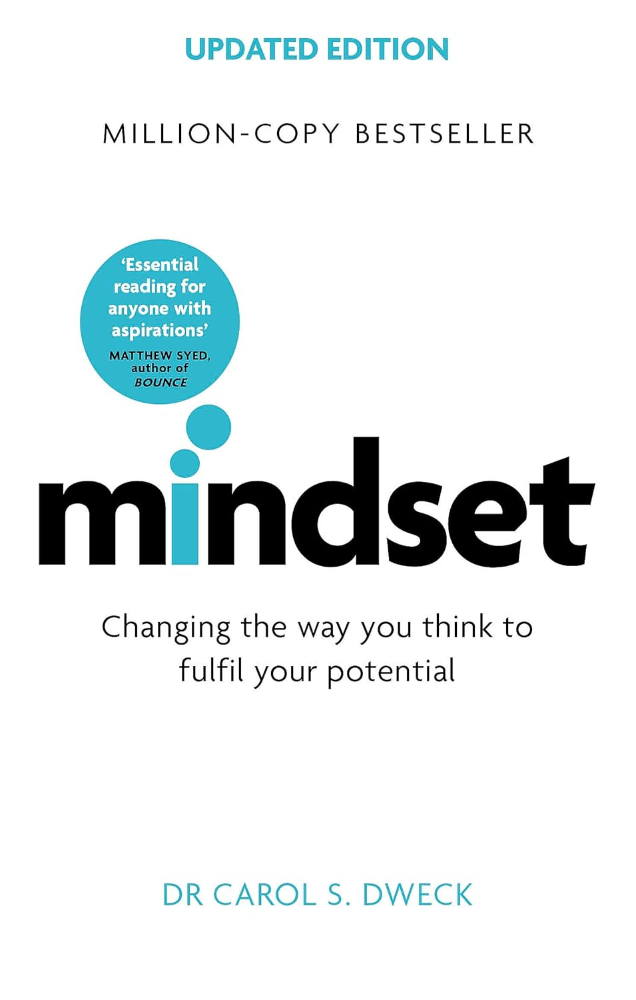



If you have struggled with dating, you may have tried reading "the game"? It's about a guy called Neil Straus in the 2000s when he stumbled into a world of pick up artists. PUA got short.

A whole bunch of texting guide books which is okay but not date changing because the strategy I use evolved is minimum amount of phone calls and texting. You only use text and phone calls to set dates to meet and not really as a tool to flirt and get to know one another. I actually get bored sitting on a phone call or texting, since I like to spend time doing things I'm interested in than

Lots of books about asking questions on dates. Again it's okay for some knowledge base.

I spent nearly 15 years learning psychology and most importantly, how to apply it in real life situations. This is more important than memorising text scripts and dating questions that "try" to make you sound interested in who they are. By understanding Psychology, it is one of the best tools that has helped me understand people, what they are thinking, and what drives them. It also was a great insight into how I, myself, works.

Learning to write better. I read a lot of books on how to structure and write blogs, general writing, writing proposals, and all of that helped improve my communication skills in words. Certainly a much better storyteller and clarity when I interact with others.

List all books actually, and say going to list them anyways, if it interests how I got to better understanding of everything. If you are wondering why some books may seem irrelevant to you, it's part of my story, and my journey of how I am this person that attracts people around me.

Trying to give you a full list of books, wouldn't work, since you aren't trying to be me. To be me, you'll have to have lived my life, read the hundred books I've read, the continuous research in different areas that interests me, and also having the same weakness I did, which I had to overcome.

I don't believe you need to read all these, but of course the more you learn, understand and apply knowledge will help with your dating and relationship life.

## Date Related Books

- [The Ultimate Texting Guide For Men 2nd Edition](https://www.amazon.co.uk/gp/product/B00F7U8KKA/)
- [Textual Attraction For Guys: The Ultimate Success Guide for Texting Girls!](https://www.amazon.co.uk/gp/product/B008ST2U3U/)
- [10 Mistakes Men Make With Women & How To Avoid Them (The Wing Girl Method Book 1)](https://www.amazon.co.uk/gp/product/B008J51XF4/)
- [Make Her Chase You: The Guide To Attracting Girls Who Are "Out Of Your League" Even If You're Not Rich Or Handsome](https://www.amazon.co.uk/gp/product/1440461546/)
- [Make Her Beg to be Your Girlfriend: Be the "Nice Guy" Who Always Gets the Girl](https://www.amazon.co.uk/gp/product/B008U3HCIC/)
- [101 Good Questions to Ask on a Date: Discover Conversation Topics and Questions that will Eliminate any Incidence of Awkward Silence and Increase Attraction with Your Date](https://www.amazon.co.uk/gp/product/1477631429/)

## Psychology Books

- [Understand Psychology: How Your Mind Works and Why You Do the Things You Do](https://www.amazon.co.uk/gp/product/1444100904/)
- [Influence: The Psychology of Persuasion](https://www.amazon.co.uk/gp/product/006124189X/)

## Featured book covers

[A New Earth - by Eckhart Tolle](https://www.amazon.co.uk/dp/0141039418)

[How To Win Friends and Influence People - by Dale Carnegie](https://www.amazon.co.uk/dp/B07FY2WWZG)

[Mindset - by Dr Carol S. Dweck](https://www.amazon.co.uk/dp/147213995X)

[The Game - by Neil Strauss](https://www.amazon.co.uk/dp/1782118934)

[Get Inside Her - The Female Perspective - by Marni Kinrys, The Ultimate Wing Girl](https://www.amazon.co.uk/dp/B00N10V8Y8)

<!-- iamhoi -->
> **The best dating book out of all the ones I've read.** Nothing beats advice from a woman to understand women! We men get it totally wrong, including many male-written dating gurus who are a load of bollocks and egocentric. Not all though, you do find some gems from male writers.
<!-- iamhoiend -->

[Mind Control: Persuasion and Dark Psychology, Persuasion Techniques, Manipulation NLP, Dark psychology mind control - by Manfred Percy](https://www.amazon.co.uk/dp/B086MMKVXY)

[The Power of Body Language: An Ex-FBI Agent's System for Speed-Reading People](https://www.amazon.co.uk/dp/B00NOI9HRC)
